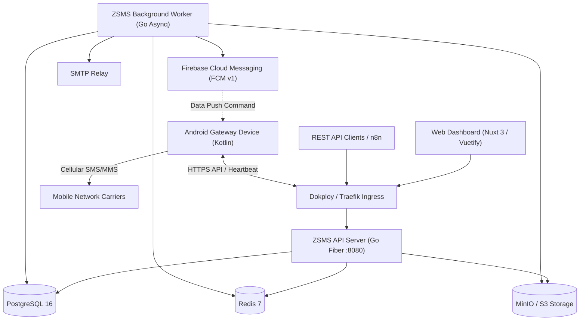

# ZSMS — Carrier-Independent Android SMS/MMS Gateway

[](docs/development/android-local-test.md)
[](LICENSE)
[](https://ztechai.us)

**ZSMS** is an enterprise-grade cellular SMS and MMS gateway platform developed from scratch for **ZTechAI**. It transforms physical Android smartphones with active SIM cards into remotely orchestratable, high-volume messaging gateways.

> [!IMPORTANT]
> **Stage 3.5 Status — Local Deployment, APK Build & Physical Cellular Validation**:
> * **Code Implementation**: `PASS` (Backend Go API, Nuxt 3 Web UI, Kotlin Android code complete)
> * **Frontend Build**: `PASS` (`vue-tsc` typecheck 0 errors, Nitro production bundle built)
> * **Backend Services**: `PASS` (Go REST & WebSocket routes, DB repos, JWT/Token auth implemented)
> * **Android Source Code**: `IMPLEMENTED` (`SmsManager`, receivers, foreground service, UI)
> * **Gradle Wrapper**: `CONFIGURED` (`gradlew`, `gradlew.bat`, `gradle-wrapper.jar` present)
> * **APK Binary**: `BLOCKED on host environment` (requires JDK 17 / Android Studio to execute build)
> * **Physical Android Handset**: `NOT TESTED` (pending user APK installation on device)
> * **Real Cellular SMS Transmission**: `NOT VERIFIED` (pending physical SIM transmission test)
>
> See the [Physical Android Testing Guide](docs/development/android-local-test.md) and [Local Development Guide](docs/development/local-development.md) for step-by-step procedures.

---

## Architecture Overview



---

## Monorepo Structure

```text
zsms/
├── backend/                 # Go Fiber API & Asynq Worker services
│   ├── api/                 # API server entrypoint (main.go)
│   ├── worker/              # Worker background engine (main.go)
│   ├── internal/            # Config, logger, database, redis, middleware, health
│   ├── tests/               # Backend unit and integration tests
│   └── Dockerfile           # Multi-stage container build
├── web/                     # Nuxt 3 + Vuetify 3 responsive SaaS dashboard
│   ├── layouts/             # App shell with responsive navigation drawer
│   ├── pages/               # 15 planned SaaS modules (Dashboard, Messages, etc.)
│   ├── plugins/             # Vuetify light & dark theme definitions
│   ├── composables/         # Typed API clients (useApi)
│   └── Dockerfile           # Multi-stage production container build
├── android/                 # Native Kotlin Android Gateway application
│   ├── app/                 # Android application module (API 26-34)
│   └── build.gradle.kts     # Gradle build configurations
├── migrations/              # Authoritative PostgreSQL schema migrations
├── docker/                  # Service initialization configurations (Postgres, Redis, MinIO)
├── docs/                    # Architecture, deployment, and development guides
├── scripts/                 # Cross-platform development and build scripts
├── docker-compose.yml       # Production Dokploy deployment blueprint
├── docker-compose.dev.yml   # Local development multi-container environment
└── .env.example             # Complete environment configuration template
```

---

## Requirements

* **Local Docker Development**: Docker Desktop for Windows or Docker Engine 24+ with Compose v2.
* **Bare-Metal Development**:
  * Node.js `v20+` and `npm`
  * Go `1.22+`
  * Android Studio Jellyfish / Iguana with Android SDK Platform 34 and JDK 17

---

## Quickstart (Local Development)

1. Clone the repository:
   ```bash
   git clone https://github.com/Zubairyounus99/httpsmsModified2.git zsms
   cd zsms
   ```

2. Configure environment:
   ```bash
   cp .env.example .env
   ```

3. Start all services using Docker Compose:
   ```bash
   docker compose -f docker-compose.dev.yml up -d
   ```

4. Access services:
   * **Web Dashboard**: [http://localhost:3000](http://localhost:3000)
   * **Backend API**: [http://localhost:8080/health/ready](http://localhost:8080/health/ready)
   * **MinIO Storage Console**: [http://localhost:9001](http://localhost:9001) (`zsms_minio_admin` / `zsms_minio_secret_key`)
   * **PostgreSQL Database**: `localhost:5432` (`zsms_user` / `zsms_dev_password`)
   * **Redis Cache & Queues**: `localhost:6379`

---

## Production Deployment (Dokploy & Contabo)

ZSMS is architected to deploy directly via Dokploy on a Contabo VPS behind Cloudflare:

* **Frontend**: `https://sms.ztechai.us`
* **REST API**: `https://sms-api.ztechai.us`
* **Documentation**: `https://docs.sms.ztechai.us`

Refer to [docs/deployment/dokploy.md](docs/deployment/dokploy.md) for full configuration instructions.

---

## Development Roadmap & Milestones

* **Stage 1**: System Architecture & Blueprint *(Approved)*
* **Stage 2**: Monorepo Foundation & Docker Environment *(Completed)*
* **Stage 3**: Authoritative PostgreSQL Schema & 28-Table DDL *(Upcoming)*
* **Stage 4**: Go Backend Core & Middleware Pipeline
* **Stage 5**: Authentication, RBAC & Scoped API Keys
* **Stage 6**: Phone Pairing Flow & Gateway Telemetry
* **Stage 7**: Android Gateway Client Foundation & FCM
* **Stage 8**: Outbound SMS Pipeline & Hardware Radio
* **Stage 9**: Inbound SMS Pipeline & Chat Threads
* **Stage 10**: MMS Multipart Attachments & S3 Abstraction
* **Stage 11**: Nuxt 3 / Vuetify Dashboard Foundation
* **Stage 12**: Address Book Contacts & Tag Management
* **Stage 13**: Bulk Broadcast SMS Campaigns
* **Stage 14**: Timezone-Aware Message Scheduler
* **Stage 15**: Webhook Event Dispatcher & n8n Integration
* **Stage 16**: OpenAPI 3.0 Documentation & Swagger UI
* **Stage 17**: Real-Time Dashboard Analytics
* **Stage 18**: Super-Admin System Management
* **Stage 19**: Security Hardening, Turnstile & Rate Limiting
* **Stage 20**: Comprehensive Automated Test Suite
* **Stage 21**: Production Docker Optimization
* **Stage 22**: Production Dokploy & Cloudflare Deployment
* **Stage 23**: Final Security & Operational Audit

---

## License

Copyright © 2026 ZTechAI. Licensed under the [Apache License, Version 2.0](LICENSE).
